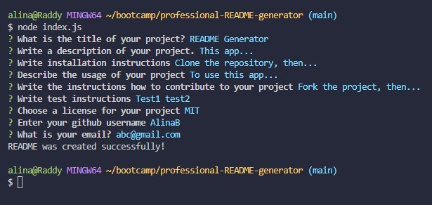

# README Generator

[](https://opensource.org/licenses/MIT)

## Description
A README Generator app, which creates a README file with the information based on the answers given to the prompted questions.
The app is made with node.js and Inquirer (from npm).

## Table of Contents
- [Installation](#installation)
- [Usage](#usage)
- [Contributing](#contributing)
- [License](#license)
- [Questions](#questions)

## Installation
Clone the repository.
```
git clone git@github.com:AlinaB108/professional-README-generator.git
```
Create package.json:
```
npm init -y
```
And then install Inquirer:
```
npm i inquirer@8.2.4
```

## Usage
To generate a README file, first run this command in an Integrated Terminal
``` 
node index.js 
```
And then answer prompt questions:



[Recording of Application](https://watch.screencastify.com/v/AokwuNlX3LsO9loeHUmd)

## Contributing
1. Fork the project by clicking Fork in the top-right corner of the page.
2. Clone the repository.
3. Create a new branch to work on.
4. Commit the changes.
5. Push to the branch.
6. Create a pull request.


## License
[](https://opensource.org/licenses/MIT)

https://opensource.org/licenses/MIT 
    
## Questions
If you have any questions, send me a message [GitHub](https://github.com/abc) or send me an email: [alinachristabel108@gmail.com](alinachristabel108@gmail.com)

